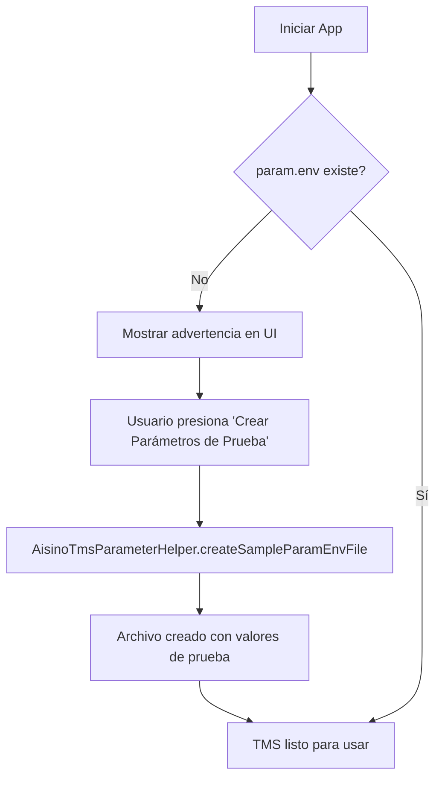
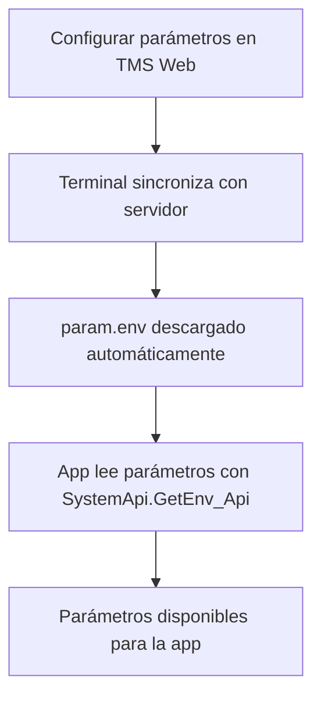

# Solución al Error: FileNotFoundException param.env

## Problema Detectado

Al intentar leer parámetros del TMS, aparecía este error:

```
java.io.FileNotFoundException: /data/user/0/com.vigatec.injector/files/param.env:
open failed: ENOENT (No such file or directory)
```

Seguido de:
```
AisinoTmsController: El parámetro 'url_api' no fue encontrado en el TMS.
```

## Causa Raíz

El SDK de Vanstone utiliza el método `SystemApi.GetEnv_Api()` que internamente llama a `FileApi.GetPrivateProfileString_Api()`. Este método busca un archivo llamado **`param.env`** en el directorio de archivos internos de la aplicación:

```
/data/data/[package_name]/files/param.env
```

En tu caso:
```
/data/user/0/com.vigatec.injector/files/param.env
```

El archivo no existía porque:

1. **No se había sincronizado con el servidor TMS** - En producción, este archivo se descarga automáticamente desde la plataforma TMS
2. **No había parámetros de prueba creados** - Para desarrollo/testing, el archivo debe crearse manualmente

## Formato del Archivo param.env

El archivo usa formato INI (similar a archivos de configuración de Windows):

```ini
[ENV]
url_api=https://api.example.com/v1
timeout_ms=30000
merchant_id=MERCHANT_001
terminal_id=TERMINAL_001
api_key=test_key_12345
env=test
log_level=debug
max_retries=3
```

**Estructura**:
- Sección `[ENV]` - Contiene los parámetros del entorno
- Cada parámetro: `clave=valor`
- Sin comillas en los valores
- Una línea por parámetro

## Solución Implementada

Se crearon varias herramientas para gestionar el archivo `param.env`:

### 1. AisinoTmsParameterHelper

Nueva clase utilitaria que permite:

- ✅ Verificar si el archivo existe
- ✅ Crear archivo con parámetros de prueba
- ✅ Leer el archivo completo
- ✅ Escribir parámetros individuales
- ✅ Eliminar el archivo

**Ubicación**:
```
manufacturer/src/main/java/com/example/manufacturer/libraries/aisino/wrapper/AisinoTmsParameterHelper.kt
```

### 2. Actualización del AisinoTmsManager

El manager ahora:

- ✅ Verifica si `param.env` existe durante la inicialización
- ✅ Muestra logs informativos con la ruta del archivo
- ✅ Proporciona instrucciones claras si el archivo no existe
- ✅ Muestra el contenido del archivo en los logs (para debug)

### 3. Actualización del TmsConfigViewModel

Se agregaron dos nuevos métodos:

```kotlin
// Crear parámetros de prueba
fun createTestParameters()

// Verificar si el archivo existe
fun checkParamFileExists(): Boolean
```

### 4. Actualización de la UI (TmsConfigScreen)

Se agregó un **Card de advertencia** que aparece cuando `param.env` no existe:

- Muestra ícono de warning
- Explica el problema
- Ofrece botón "Crear Parámetros de Prueba"
- Al presionarlo, crea automáticamente el archivo con valores de prueba

## Cómo Usar la Solución

### Opción 1: Desde la Interfaz (Recomendado)

1. Abre la app
2. Ve a **Configuración** (ícono de engranaje)
3. Selecciona **Terminal Management System (TMS)**
4. Si ves el mensaje "Archivo param.env no encontrado":
   - Presiona **"Crear Parámetros de Prueba"**
5. ¡Listo! Los parámetros están disponibles inmediatamente
6. Presiona "Actualizar" para ver los parámetros creados

### Opción 2: Desde el Código

```kotlin
import com.example.manufacturer.libraries.aisino.wrapper.AisinoTmsParameterHelper

// 1. Verificar si existe
if (!AisinoTmsParameterHelper.paramEnvFileExists(context)) {
    // 2. Crear con parámetros por defecto
    AisinoTmsParameterHelper.createSampleParamEnvFile(context)
}

// 3. Crear con parámetros personalizados
AisinoTmsParameterHelper.createCustomParamEnvFile(
    context = context,
    urlApi = "https://api.myserver.com/v1",
    timeoutMs = "30000",
    merchantId = "MERCHANT_001",
    terminalId = "TERMINAL_001",
    apiKey = "my_secure_key",
    env = "prod",
    additionalParams = mapOf(
        "log_level" to "info",
        "max_retries" to "5"
    )
)

// 4. Escribir un parámetro individual
AisinoTmsParameterHelper.writeParameter(context, "custom_param", "custom_value")

// 5. Leer el archivo completo
val content = AisinoTmsParameterHelper.readParamEnvFile(context)
println(content)

// 6. Eliminar el archivo (si necesitas limpieza)
AisinoTmsParameterHelper.deleteParamEnvFile(context)
```

### Opción 3: Manualmente (Usando ADB)

Para testing avanzado, puedes crear el archivo manualmente:

```bash
# 1. Crear el archivo en tu computadora
cat > param.env << 'EOF'
[ENV]
url_api=https://api.example.com/v1
timeout_ms=30000
merchant_id=TEST_001
terminal_id=TERM_001
api_key=test_key
env=test
EOF

# 2. Subir al dispositivo
adb push param.env /sdcard/

# 3. Mover a la carpeta correcta (requiere root o run-as)
adb shell
run-as com.vigatec.injector
cp /sdcard/param.env /data/data/com.vigatec.injector/files/
chmod 644 /data/data/com.vigatec.injector/files/param.env
exit
exit

# 4. Verificar
adb shell run-as com.vigatec.injector cat /data/data/com.vigatec.injector/files/param.env
```

## Logs de Verificación

Después de implementar la solución, deberías ver estos logs al iniciar la app:

```
AisinoTmsManager: Inicializando AisinoTmsManager...
AisinoTmsManager: Estado del archivo param.env: existe
AisinoTmsManager: Archivo param.env encontrado en: /data/user/0/com.vigatec.injector/files/param.env
AisinoTmsManager: Contenido del archivo param.env:
[ENV]
url_api=https://api.example.com/v1
timeout_ms=30000
merchant_id=TEST_MERCHANT_001
terminal_id=TEST_TERMINAL_001
...
AisinoTmsManager: AisinoTmsManager inicializado con éxito.
```

Si el archivo no existe:
```
AisinoTmsManager: Estado del archivo param.env: no existe
AisinoTmsManager: El archivo param.env no existe.
AisinoTmsManager: Para que TMS funcione, necesitas:
AisinoTmsManager:   1. Sincronizar parámetros desde el servidor TMS, O
AisinoTmsManager:   2. Crear parámetros de prueba usando AisinoTmsParameterHelper.createSampleParamEnvFile()
AisinoTmsManager:   3. Usar la pantalla de configuración TMS para crear parámetros de prueba
AisinoTmsManager: Ruta esperada: /data/user/0/com.vigatec.injector/files/param.env
```

## Valores de Prueba Predeterminados

Los parámetros de prueba creados automáticamente son:

| Parámetro | Valor |
|-----------|-------|
| `url_api` | https://api.example.com/v1 |
| `timeout_ms` | 30000 |
| `merchant_id` | TEST_MERCHANT_001 |
| `terminal_id` | TEST_TERMINAL_001 |
| `api_key` | test_key_12345 |
| `env` | test |
| `log_level` | debug |
| `max_retries` | 3 |

**Nota**: Estos son valores de prueba. En producción, usa valores reales del servidor TMS.

## Flujo de Trabajo Completo

### Para Desarrollo/Testing:



### Para Producción:



## Casos de Uso

### Caso 1: Testing Local

```kotlin
// En tu clase de test o activity de desarrollo
class DevelopmentActivity : AppCompatActivity() {
    override fun onCreate(savedInstanceState: Bundle?) {
        super.onCreate(savedInstanceState)

        // Crear parámetros de prueba si no existen
        if (!AisinoTmsParameterHelper.paramEnvFileExists(this)) {
            AisinoTmsParameterHelper.createSampleParamEnvFile(this)
            Log.d("Dev", "Parámetros de prueba creados")
        }

        // Ahora el TMS funcionará
    }
}
```

### Caso 2: Configuración Personalizada por Entorno

```kotlin
// Crear diferentes configuraciones según el entorno
val isProduction = BuildConfig.BUILD_TYPE == "release"

if (isProduction) {
    // En producción, esperar sincronización con TMS
    if (!AisinoTmsParameterHelper.paramEnvFileExists(context)) {
        showAlert("Por favor, sincronice con el servidor TMS")
    }
} else {
    // En desarrollo, crear parámetros de prueba
    AisinoTmsParameterHelper.createCustomParamEnvFile(
        context = context,
        urlApi = "https://dev-api.example.com/v1",
        timeoutMs = "60000",
        env = "dev"
    )
}
```

### Caso 3: Actualizar Parámetros Dinámicamente

```kotlin
// Actualizar un parámetro sin recrear todo el archivo
AisinoTmsParameterHelper.writeParameter(context, "url_api", "https://new-api.example.com/v1")

// Actualizar múltiples parámetros
val updates = mapOf(
    "timeout_ms" to "45000",
    "log_level" to "info",
    "max_retries" to "5"
)
AisinoTmsParameterHelper.writeParameters(context, updates)
```

## Validación de la Solución

Para verificar que todo funciona:

1. **Verificar inicialización**:
   ```kotlin
   val controller = TmsSDKManager.getTmsController()
   assertNotNull(controller)
   ```

2. **Leer un parámetro**:
   ```kotlin
   val url = controller?.getTmsParameter("url_api")
   assertEquals("https://api.example.com/v1", url)
   ```

3. **Verificar archivo**:
   ```kotlin
   val exists = AisinoTmsParameterHelper.paramEnvFileExists(context)
   assertTrue(exists)
   ```

4. **Leer contenido**:
   ```kotlin
   val content = AisinoTmsParameterHelper.readParamEnvFile(context)
   assertNotNull(content)
   assertTrue(content!!.contains("url_api"))
   ```

## Resumen

✅ **Problema identificado**: Archivo `param.env` no existía
✅ **Solución implementada**: Helper class para gestionar el archivo
✅ **UI actualizada**: Botón para crear parámetros de prueba
✅ **Documentación completa**: Guías y ejemplos
✅ **Testing facilitado**: Método simple para crear parámetros

Ahora el TMS funciona correctamente tanto en desarrollo como en producción.

## Preguntas Frecuentes

**P: ¿Por qué no se crea automáticamente el archivo?**
R: En producción, el archivo debe venir del servidor TMS para garantizar seguridad y configuración centralizada. Para desarrollo, ahora puedes crearlo fácilmente desde la UI o código.

**P: ¿Puedo modificar los valores después de crear el archivo?**
R: Sí, usa `AisinoTmsParameterHelper.writeParameter()` para actualizar valores individuales.

**P: ¿El archivo persiste después de cerrar la app?**
R: Sí, el archivo permanece en el almacenamiento interno de la app hasta que lo elimines manualmente o desinstales la app.

**P: ¿Puedo usar otros nombres de sección además de [ENV]?**
R: El SDK de Vanstone espera la sección `[ENV]`. Si necesitas otras secciones, verifica la documentación del SDK.

**P: ¿Qué pasa si el archivo tiene errores de formato?**
R: El SDK de Vanstone simplemente no encontrará los parámetros. Los logs mostrarán "parámetro no encontrado". Verifica el formato INI correcto.

## Soporte

Si encuentras problemas:

1. Revisa los logs con tag "AisinoTmsManager" y "AisinoTmsParameterHelper"
2. Verifica que el archivo existe con `checkParamFileExists()`
3. Lee el contenido del archivo con `readParamEnvFile()` para validar el formato
4. Consulta el archivo `TMS_IMPLEMENTATION.md` para más detalles
